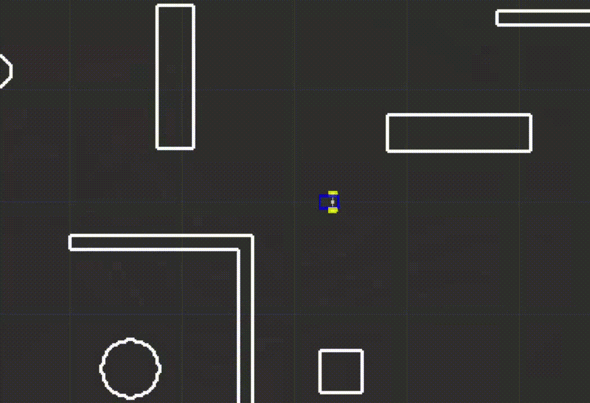
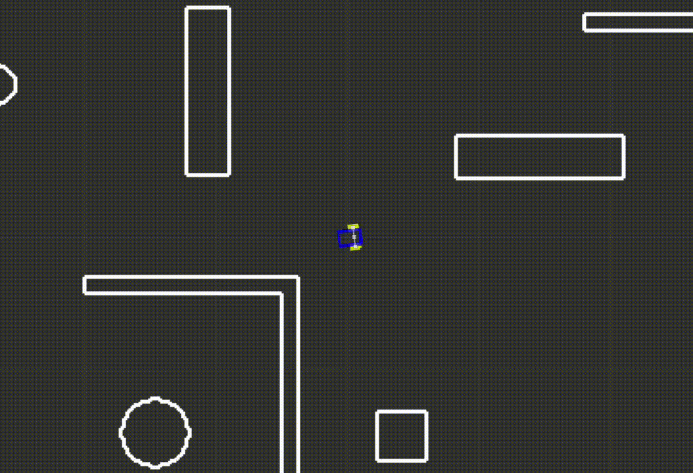
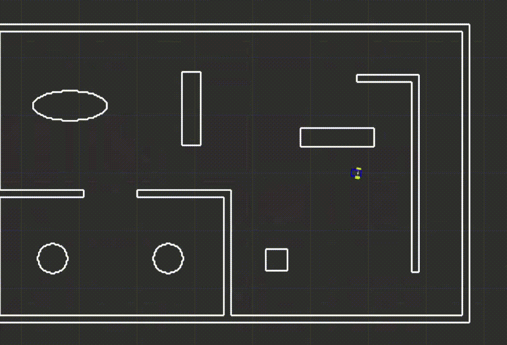

# Base robot controller for ROS2 and Flatland 

Base robot controller project for Flatland packages using ROS2.

Inside the file [\_\_init\_\_.py](serp_controller/__init__.py) there are comments with intructions and code examples on how and where to add your code to create a controller.

## Setup the package

Clone the repository inside `workspace/src`:
```
git clone https://github.com/FilipeAlmeidaFEUP/ros2_flatland_robot_controller.git
```

Build inside the `workspace` folder:
```
rosdep install -i --from-path src --rosdistro humble -y
colcon build
source install/setup.bash
```

Run the package:
```
ros2 launch serp_controller serp_controller.launch.py
```

## Code examples

Example 1: A robot that moves forward



Example 2: A robot that moves in a circle



Example 3: A robot that moves forward and turns to the right when it finds an obstacle in front of it


